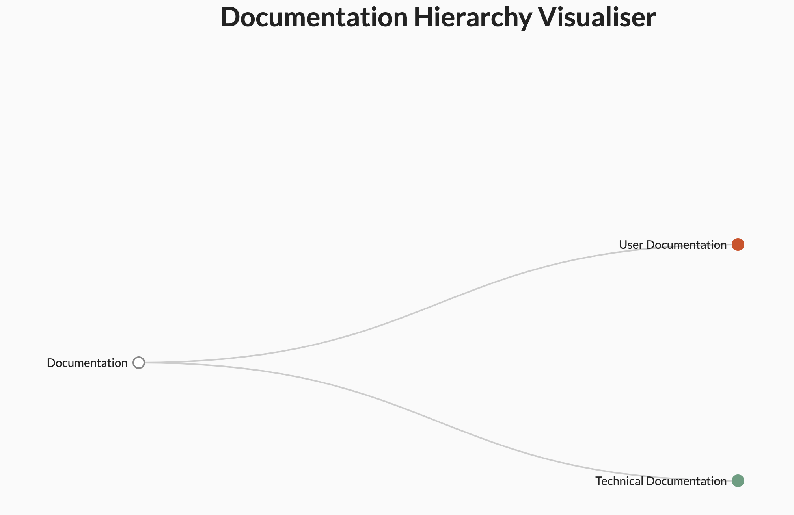

# Documentation Hierarchy Visualiser

## Description

An interactive D3.js visualisation that maps different types of documentation used in software development.

## User Documentation

The documentation tree is an interactive diagram that helps you explore topics visually. Each bubble represents a section of the documentation.

When you click [the live link](https://edgenortheastern.github.io/d3-user-tech-docs/), you will see the initial hierarchy diagram, as shown below in Figure 1.

**Figure 1: Starting hierarchy diagram**

## Technical Documentation
